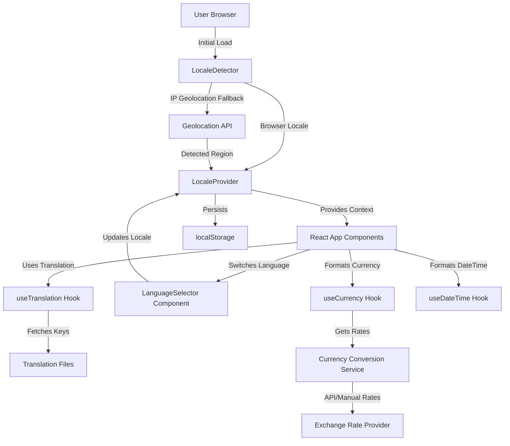
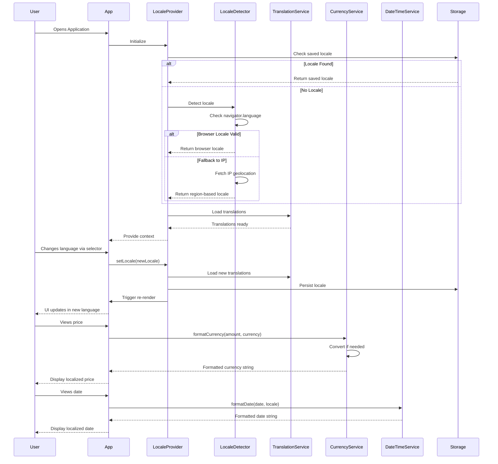

# Design Document: Comprehensive Localization System for WorkPilot AI

## Overview

The WorkPilot AI Localization System provides comprehensive internationalization (i18n) support for 8 languages across the entire React frontend. The system enables automatic language detection, real-time language switching without page reload, currency conversion with locale-specific formatting, date/time localization respecting cultural preferences, and persistent language preferences. The architecture is designed for B2B SaaS targeting global teams with an initial focus on US, European, Latin American, and Asian markets.

**Target Languages**: English (en-US), Spanish (es-ES), French (fr-FR), German (de-DE), Japanese (ja-JP), Portuguese (pt-BR), Chinese Simplified (zh-CN), Hindi (hi-IN)

**Key Technical Approach**: Context-based React architecture with custom hooks, structured translation files organized by feature/page, intelligent locale detection using browser API and IP geolocation fallback, and localStorage-based preference persistence. The design integrates seamlessly with the existing React 19.2.7 + Vite 8.1.1 stack without introducing heavy i18n libraries.

## Architecture

### System Architecture



### Component Interaction Flow



## Components and Interfaces

### Component 1: LocaleProvider

**Purpose**: Global context provider that manages current locale, loads translations, and exposes localization utilities to all child components.

**Interface**:
```typescript
interface LocaleProviderProps {
  children: React.ReactNode;
  defaultLocale?: SupportedLocale;
  storageKey?: string;
}


interface LocaleContextValue {
  locale: SupportedLocale;
  setLocale: (locale: SupportedLocale) => void;
  translations: TranslationDictionary;
  isLoading: boolean;
  error: Error | null;
}
```

**Responsibilities**:
- Detect initial locale on mount using LocaleDetector
- Load and cache translation files for current locale
- Persist locale preference to localStorage
- Provide locale context to all descendant components
- Handle locale switching and re-rendering
- Manage loading states and error handling

### Component 2: LanguageSelector

**Purpose**: UI component in navigation bar that displays current language and provides dropdown to switch languages.

**Interface**:
```typescript
interface LanguageSelectorProps {
  className?: string;
  dropdownPosition?: 'left' | 'right';
  showFlag?: boolean;
  showLabel?: boolean;
}
```

**Responsibilities**:
- Display current language with optional flag emoji
- Render dropdown with all supported languages
- Call setLocale when user selects new language
- Integrate with existing Navbar component styling
- Support mobile-responsive design
- Provide accessible keyboard navigation


### Component 3: LocaleDetector

**Purpose**: Service module that determines the best initial locale based on browser settings and IP geolocation.

**Interface**:
```typescript
interface LocaleDetectorConfig {
  supportedLocales: SupportedLocale[];
  fallbackLocale: SupportedLocale;
  geolocationApiUrl?: string;
}

interface LocaleDetector {
  detectLocale(config: LocaleDetectorConfig): Promise<SupportedLocale>;
  getBrowserLocale(): string | null;
  getGeolocationLocale(): Promise<string | null>;
  normalizeLocale(rawLocale: string, supportedLocales: SupportedLocale[]): SupportedLocale;
}
```

**Responsibilities**:
- Check navigator.language and navigator.languages
- Map browser locale codes to supported locales
- Fallback to IP geolocation API if browser locale unsupported
- Handle geolocation API failures gracefully
- Return normalized locale code matching SupportedLocale enum

### Component 4: TranslationService

**Purpose**: Service module that loads, caches, and retrieves translation strings organized by feature/page namespaces.

**Interface**:
```typescript
interface TranslationService {
  loadTranslations(locale: SupportedLocale): Promise<TranslationDictionary>;
  getTranslation(key: string, params?: Record<string, string | number>): string;
  hasTranslation(key: string): boolean;
  interpolate(template: string, params: Record<string, string | number>): string;
}
